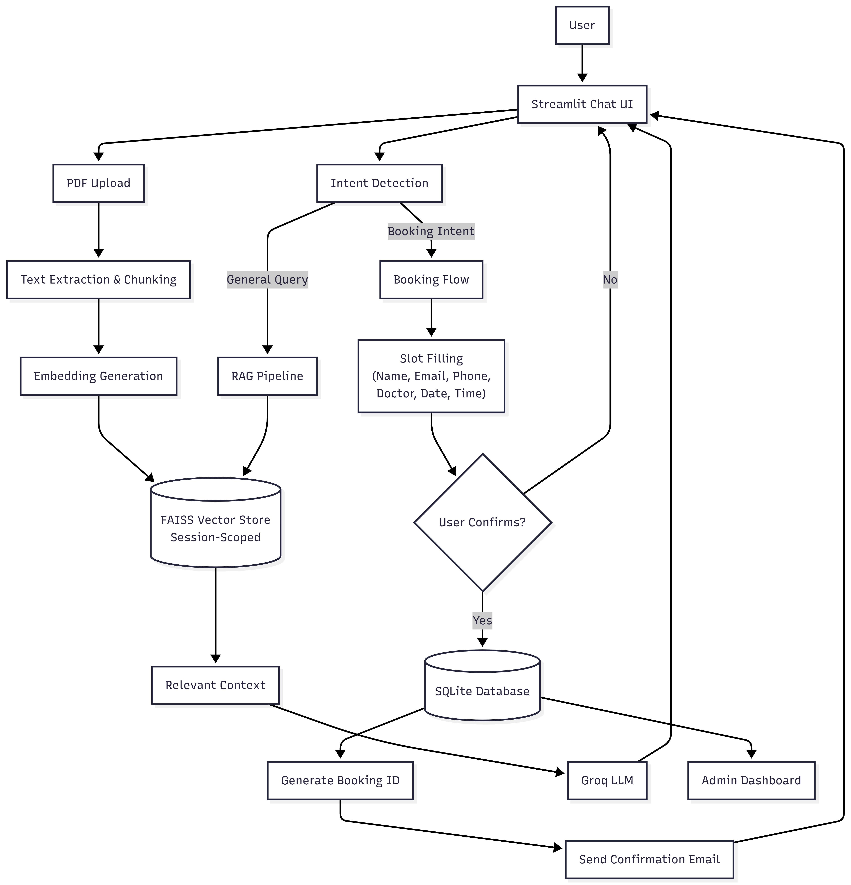

# AI Doctor Booking Assistant

A conversational AI-powered booking assistant that supports document-based question answering (RAG) and an end-to-end doctor appointment booking workflow.  
The application is built using Streamlit and deployed for public access.

**Live Demo:**  
https://llmragbookingsystem.streamlit.app/

---

## Project Overview

This project implements a **chat-based AI Booking Assistant** that enables users to:

- Ask questions based on uploaded PDF documents (RAG).
- Book doctor appointments through a guided, multi-turn conversation.
- Confirm and store booking details reliably.
- Receive email confirmations after successful bookings.
- Allow administrators to view and manage bookings through an admin dashboard.

The focus of the project is on **robust system design, conversational state handling, and reliable end-to-end functionality**.

---

## System Flow Diagram

The diagram below illustrates the end-to-end flow of the AI Doctor Booking Assistant,
covering user interaction, intent detection, document-based Q&A (RAG),
appointment booking, persistence, and admin access.




## Key Features

### Document-Based Question Answering (RAG)

- Supports uploading one or more PDF documents.
- Documents are processed into embeddings and stored in a vector index.
- User queries are answered strictly using retrieved document context.
- Handles missing or invalid documents gracefully.

---

### Conversational Booking Assistant

- Chat-based interface with short-term memory (last 20–25 messages).
- Automatically routes:
  - General queries → RAG pipeline
  - Booking intent → booking workflow
- Ensures smooth, stateful multi-turn interactions.

---

### Appointment Booking Flow

The assistant collects the following details step by step:

1. Full name  
2. Email address  
3. Phone number  
4. Doctor or specialty  
5. Appointment date  
6. Appointment time  

Key characteristics:
- Each question is asked only once.
- Inputs are validated before acceptance.
- Booking proceeds only after explicit user confirmation.

---

### Confirmation, Storage, and Email

- On confirmation:
  - Booking details are stored in a SQLite database.
  - A unique booking ID is generated.
- A confirmation email is sent to the user containing appointment details.
- If email delivery fails, the booking is still saved and the user is informed.

Email delivery is implemented using SMTP with Gmail App Passwords and Streamlit secrets.

---

### Admin Dashboard

- Accessible via a sidebar mode selector.
- Displays all stored bookings.
- Supports searching by name or email.
- Provides basic administrative visibility into bookings.

---

## Architecture Overview

- **Frontend & Backend:** Streamlit  
- **RAG Pipeline:** PDF ingestion, chunking, embeddings, vector similarity search  
- **LLM:** Groq (via OpenAI-compatible REST API)  
- **Vector Store:** FAISS (session-scoped, disk-backed)  
- **Database:** SQLite  
- **Email Service:** SMTP  

---

## Project Structure

```
project_root/
├── app/
│   ├── main.py              # Streamlit entry point
│   ├── chat_logic.py        # Intent detection & chat memory
│   ├── booking_flow.py      # Slot filling, validation, confirmation
│   ├── rag_pipeline.py      # RAG logic
│   ├── tools.py             # Database and email utilities
│   ├── admin_dashboard.py   # Admin UI
│   └── utils/
│       └── faiss_store.py   # Session-scoped FAISS persistence
│
├── db/
│   ├── database.py          # SQLite connection
│   └── models.py            # Database schema
│
├── .streamlit/
│   └── secrets.toml         # Secrets (not committed)
│
├── requirements.txt
└── README.md
```

---

## Running Locally

### Prerequisites
- Python 3.9+
- Git
- Streamlit

### Steps
```bash
pip install -r requirements.txt
streamlit run app/main.py
```

---

## Deployment

- Deployed using **Streamlit Cloud**.
- Secrets are managed via Streamlit Cloud settings.
- Publicly accessible through the live demo link above.

---

## Error Handling & Validation

The system validates and handles:
- Invalid email and phone formats
- Incorrect date/time inputs
- Missing or invalid PDF uploads
- Database errors
- Email delivery failures

All errors are communicated using clear, user-friendly messages.

---
